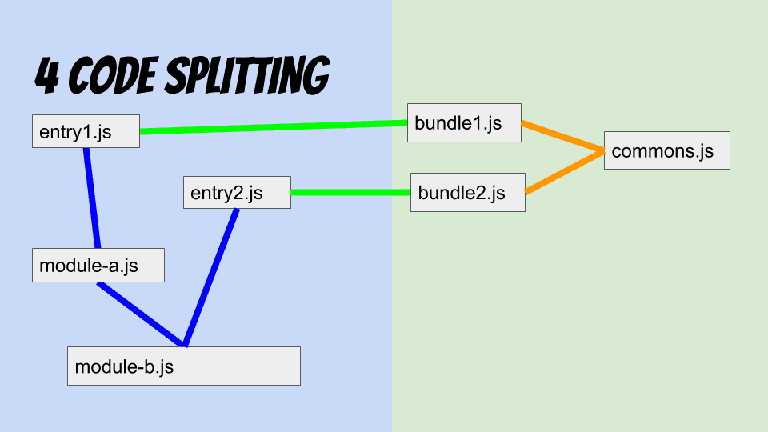

// asciidoctor -b html5 -r asciidoctor-diagram theia.adoc

= Theia
Connor Clark <connor.clark@coursehero.com>
v1.1, {localdate}
:toc: left
:sectnums:
:icons: font
:source-highlighter: rouge
:title-logo-image: 

== Overview

`Theia` (the link:http://www.theoi.com/Titan/TitanisTheia.html[Greek Titaness] of sight, beauty, and shiny things) is a Node microservice which will provide Server Side Rendering (SSR) and Code Splitting (CS) for React applications. SSR is the primary benefit, and CS can be left out of a MVP.

Think of it as a `Render Service`, or `React As A Service`.

The first use case of `Theia` will be CHESS's link:https://git.coursehero.com/coursehero/components/study-guides[`study-guides`] component library.

See <<Diagram>> for a visual representation of the architecture.

== Background

CHESS is currently building course-specific study guides (starting with Introduction to Biology, Macroeconomics, and Microeconomics). The study guides are being built as single page React applications. Creating a way to render these pages on the back end is extremely important for SEO. The hope is that `Theia` will be useful for future React endeavors at Course Hero.

One reason for building this as a separate microservice is to avoid installing a link:https://github.com/phpv8/v8js[PHP runtime extension for V8 (JavaScript)] on all the webservers. The performance implications of such an extension are unclear.

== Definitions

=== Server Side Rendering (SSR)

The initial HTML which a React component renders can be done by the server, and then sent to the client on the initial document request. When the client loads all the JavaScript needed, fetches data required, and finishes rendering the initial view locally, the browser will "take control." This process is called hydration.

SSR reduces inital page load time, which is ideal for SEO. Assuming a cache hit, the initial page rendering has already been done, so the user does not have to wait for React to see the content. Even ignoring SEO concerns, SSR makes for a snappier user experience with fewer loading screens.

A commonly cited disadvantage of SSR is the increase in time for serving requests. This can be remedied by using a cache. `Theia` should be limited to use cases which can be fully enumerated in a cache, or are not important for SEO (and thus a loading spinner is acceptable on cache-misses).

=== Code Splitting (CS)

For any particular JavaScript browser application, not all the code / assets are necessary for the initial page load. Delivery of these files can be delayed until needed, awaiting interaction from the user.

A live example of this can be seen in any Google Drive document. Open the Developer Tools, go to the Network tab, clear the current log, and hit the "Share" button. The browser will make a number of requests for JavaScript and various assets.

Each "piece" of an application is called a chunk. Chunks are created by the bundling process. There are various strategies for chunking applications. Distinct React components used in a React Router are natural places for chunk boundries, and modules required by multiple chunks can be bundled into a "common" chunk to minimize code duplication.

Besides reduced initial page load time, chunking reduces the amount of data users must download when an application is updated.

link:https://webpack.js.org/guides/code-splitting[Webpack's documentation] offers more details about CS.

link:https://medium.com/webpack/bundle-buddy-and-webpack-commons-chunk-101da29166bf[Bundle Buddy] and link:https://www.npmjs.com/package/webpack-bundle-analyzer[Webpack Bundle Analyzer] are good tools for tuning chunks.

NOTE: The full benefits of CS won't be realized by Theia, as every page includes many resources from Assetic in the `head` HTML tag (which blocks initial page load). Only when the way assets are included changes will this benefit fully kick in.

=== Component Library (CL)

React libraries which 1) build themselves and 2) export components via a `component-manifest.js` file.

=== Hotloading

Automatic re-rendering of React in the browser (in a local environment) when developing new features.

=== Consumer

Users of Theia.

== Requirements

=== SSR

Given a component name and props, `Theia` should render the result using link:https://reactjs.org/docs/react-dom-server.html#rendertostring[ReactDOMServer.renderToString].

=== CS

Should be optional. An application that doesn't care about CS should just export everything in one bundle.

Applications utilizing CS should use the universal React libraries.

* Backend: link:https://github.com/faceyspacey/webpack-flush-chunks[Webpack Flush Chunks]
* Frontend: link:https://github.com/faceyspacey/react-universal-component[React Universal Component]

link:https://medium.com/webpack/webpack-bits-getting-the-most-out-of-the-commonschunkplugin-ab389e5f318[`CommonsChunkPlugin`] should be used to split up modules into common chunks.

Cached renders will only provide the chunks used to generate the initial view. For example:

....
`/chunks/<somehash>-bootstrap.js` - The webpack bootloader. This file changes frequently.
`/chunks/<somehash>-vendor.js` - node_modules. These wouldn't change as often at the main application code.

`/chunks/<somehash>-chunk-01.js` - w/e js chunks that Theia used to render the initial view
`/chunks/<somehash>-chunk-03.js`

`/chunks/<somehash>-main.js` - main entry point

`/chunks/<somehash>-chunk-02.css` - css chunks needed
....

=== Webpack Bundling

`Theia` should build each CL using the dependencies as defined within that CL's `package.json` - including Webpack. This will keep all CLs isolated from each other, and make updating a project's dependencies much simpler.

`Theia` needs the Webpack `stats` file to utilize CS. This can be done for each CL by running `webpack --json > stats.json`.

Chunks should be uploaded to the `File Cabinet`, so that webservers can resolve requests.

Each CL will be responsible for providing its own `webpack.prod.js` config file. Chunking isn't required, but each output file should contain a `[hash]` tag.

CLs should shim React, and only use React v15, until someone smart comes along and figures out how to have multiple versions of React on a single page.

CLs should NOT use UglifyJS. Cloudfare does that, so doing it at the bundling step would result in poor minification.

CLs can optionally export source maps.

WARNING: Unresolved: How can rollbar automatically use these source maps?

=== Cache

`Theia` should memcache the result of render requests: the SSR html and the minimal chunks required to do the rendering.

Consumers read directly from memcache - there is no communication with `Theia` on a cache hit.

When a CL is updated, `Theia` should call a CL-specific cache reheating function.

=== Hotloading

A local, uncommitted configuration file should allow for resolving CLs locally. Assume `/websites/coursehero/components`, otherwise read from configuration for non-standard local environments.

`Theia` can run `webpack-dev-server` to start a dev server for a CL. Render requests with a `hotload` payload should kick off a dev server (if not already running).

WARNING: Unresolved: It should probably close it after X minutes of inactivity. There seems to be no way to do that through the Webpack Dev Server API. Only hacky ways come to mind.

=== Continuous Deployment

Configure which branch to deploy from (`master` or `dev`).

Poll for new commits.

WARNING: Unresolved: Should CLs contain post-push git hooks on origin?

If a CL utilizes any API endpoints, and an update expects new functionality, the Monolith (or w/e services the API) MUST be updated first, and in such a way that old API calls still work (forwards compatibility? or just use versioned endpoints `/api/v2/etc.`).

No downtime between CL updates. This means that old chunks should not be removed from the `File Cabinet` when building an update to a CL - existing user sessions may still request those files. They should be removed only after some time has passed. Otherwise, a chunk request would fail as the user moved around the application. They will only be removed after a day or so, when it's more likely no user sessions remain.

NOTE: Shouldn't assume that Cloudfare's cache would suffice for this problem. There's a stupid small chance that some chunk would not be cached in the CDN, if updates were frequent enough / a chunk is accessed rarely.

== Implementation

=== Diagram

// http://ditaa.sourceforge.net/
[ditaa, resources/diagram]
....
+-------------+           miss     +--------+
| Consumer    |-------+----------->| Theia  | update (continuous deployment)
|   (Monolith)|       |            |        |<-------+
+-------------+    hit|            +--------+        |
        ^    ^        v              |     |         |
        |    |      +--------+       |     |         |
        |    |      |{s}     |       |     |    +-----------+
        |    +------|memcache|<------+     |    |{io} CL    |
        |     html  |        |   cache     |    |           |
        |      +    +--------+             |    +-----------+
        |     chunks    ^                  |
        |               |                  |
        |               |  reheat cache    |
        |               +------------------+
        |                                  |
        |                                  |
        |           +------------+         |
        |           |{s}         |         |
        |           |File Cabinet|<--------+
        |           |            | save build assets
        |           +------------+
        |                 ^
        |                 |
        |                 |
+-------------+           |
| Browser     |-----------+
|          {d}|  chunks requests (.js, .css)
+-------------+  (CloudFare would cache this part)
....

=== Details

Consumers will interact with `Theia` via HTTP.

Payload schema:
[source,javascript]
POST /render
{
    "library": "@coursehero-components/study-guides",
    "component": "CourseApp",
    "props": { ... },
    "key": "... application-specific key, unique to these props ..."
    "hotload": { // optional, only for local use
        "port": 8888
    }
}

`Theia` will have a configuration file containing an ssh git link to each CL.

config.json
[source,json]
{
    "dev": {
        "branch": "dev"
    },
    "prod": {
        "branch": "master"
    },
    "libraries": {
        "@coursehero-components/study-guides": "git@git.coursehero.com:coursehero/components/study-guides.git"
    }
}

One caveat of this is that any API endpoints accessed on the Monolith should be backwards compatabile, to prevent things breaking between steps 5 and 6. A verisoned API endpoint would suffice, and support can be removed after a reasonable amount of time (a day?)

WARNING: Unresolved: Would it be better to force all sessions to refresh? How could that work?

== Flow

=== Render Request (Cache Hit)

1. Request comes into Monolith.
2. Application-specific key used to check memcache. Hit.
3. Monolith injects initialHtml, js, and css chunks into Twig file (not via Assetic).
4. As the user interacts with the React app, additional chunks are requested (Universal Component handles this).

=== Render Request (Cache Miss)

For `study-guides`, every page can fit nicely into cache. This may not be true for other use cases.

1. Request comes into Monolith.
2. Application-specific key used to check memcache. Miss.
3. The Monolith can decide to wait for `Theia` to render, or can provide the client with the entry chunk and allow a loading view to display.
4. Either way, the result would be in cache for next time.

=== Updating a CL

Updating a CL should follow this development process:

1. Develop new feature for CL in feature branch.
2. Merge dependent (if any) Monolith changes into dev. These would be whatever API endpoint the CL accesses.
3. Merge CL feature branch to dev.
4. Verify things work on dev.
5. Merge Monolith changes (if any) to master.
6. Merge feature branch on CL to master.

When `Theia` builds an update to a CL, it will kick off a CL-specific caching callback:

1. CL is updated (master or dev).
2. `Theia` picks up change, builds new version.
3. When build is done, caching callback is fired, which fills cache with new content.
4. Sometime in the future, the old File Cabinet chunks are deleted.

== Miscellaneous

* link:https://git.coursehero.com/coursehero/theia/blob/e75c83dace101f471f986dcfe8a3b4907556e168/docs/ar-render-service.md[Original `Render Service` AR].
* `study-guides` does not use Redux, so hydrating a redux store is not part of v1.

== Task Breakdown

awaiting feedback ...

CS can be left out of the MVP.

== Discussion

Direct all discussion to link:https://course-hero.slack.com/archives/C82ECUK0W/p1512090671000073[this Slack thread].
